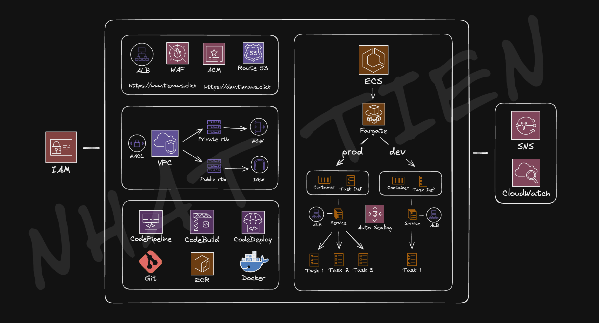
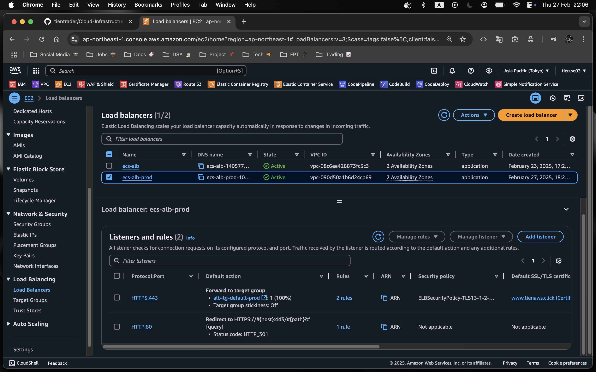
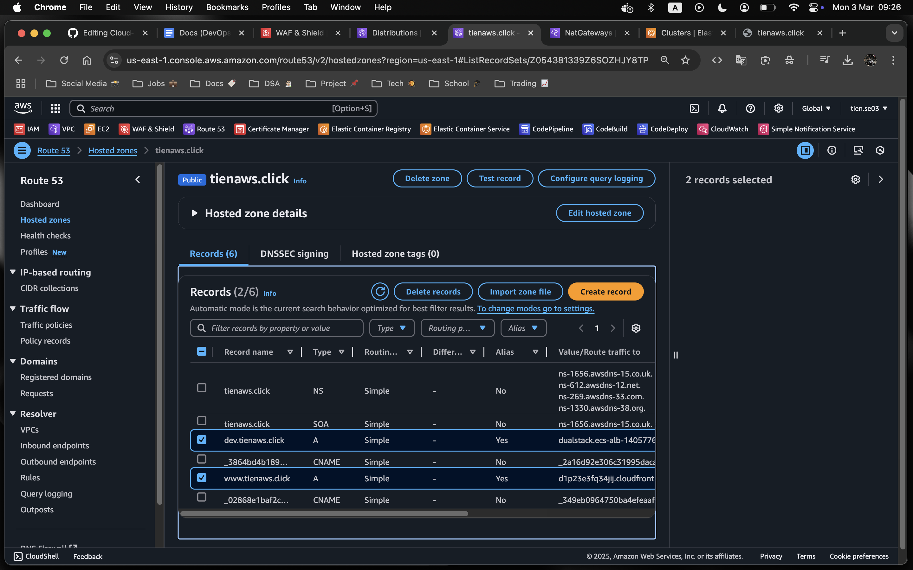
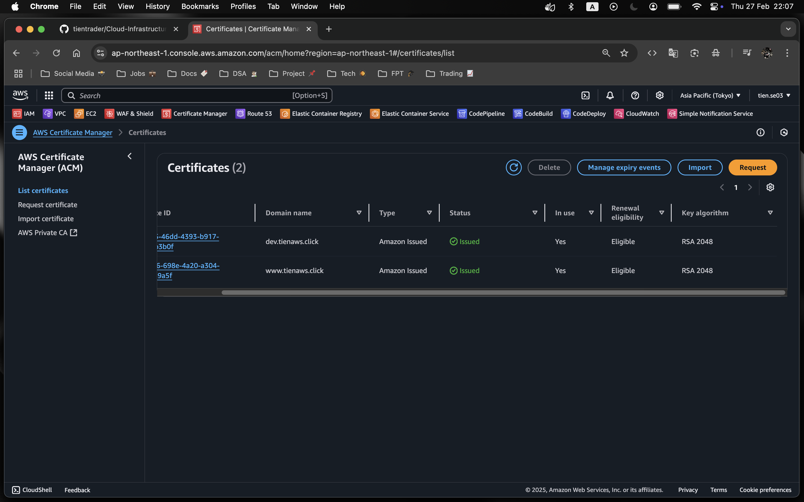

# 📌 Cloud Application Deployment with AWS ECS

## 📝 Project Overview

This project aims to deploy and manage containerized applications on AWS using Amazon ECS (Elastic Container Service). The solution supports both EC2 and Fargate launch types, providing a highly scalable, secure, and automated cloud deployment model that adheres to AWS best practices. The infrastructure leverages key AWS services including VPC, Subnets, Internet Gateway, NAT Gateway, Application Load Balancer (ALB), Security Groups, ECS Clusters, Task Definitions, and Auto Scaling. Additionally, the project integrates AWS Route 53 and ACM for secure HTTPS access.

  

## 🏗 Architecture & Technologies

### 🧱 Infrastructure & Networking

- **Amazon VPC (Virtual Private Cloud)**:  
  A custom VPC (`container_vpc`) with six subnets, including public, private, and database subnets, designed to isolate workloads for enhanced security.

- **Internet Gateway (IGW)**:  
  Enables access to public resources from the internet, attached to `container_vpc`.

- **NAT Gateway (NGW)**:  
  Provides secure internet access for private subnets, associated with an Elastic IP in `container_public_az1`.

- **Route Tables**:

  - **Public Route Table**: Routes traffic from public subnets to the internet via IGW.
  - **Private Route Table**: Routes traffic from private subnets to the internet via NGW.

- **Network ACLs (NACLs)**:  
  Configured to manage inbound and outbound traffic across subnets, ensuring robust security across the environment.

  

- **Security Groups (SGs)**:
  - **container_public_sg**: Allows inbound HTTP (80), HTTPS (443), and application-specific port (8080) traffic.
  - **container_private_sg**: Restricts access to private subnets, only allowing traffic originating from the Application Load Balancer (ALB).
 
  

### 🐳 Compute & Container Orchestration

- **Amazon ECS Cluster (`tienaws-ecs`)**:  
  Manages containerized workloads and tasks across EC2 and Fargate launch types.

- **AWS Fargate**:  
  A serverless compute engine that abstracts infrastructure management, allowing ECS tasks to be run without the need for provisioning servers.

- **EC2 Instance**:  
  ECS-optimized Amazon Linux 2 instance (`t2.micro`), used to support EC2-based ECS deployments.

- **Docker**:  
  Container runtime used to run containerized applications within ECS tasks.

- **ECR**:  
  A fully managed Docker container registry where images used by ECS tasks are stored.

  

### 💸 Deployment & Scaling

- **Task Definitions**:

  - `order-ec2-td`: Task definition for EC2-based deployments, using the `awsvpc` networking mode.
  - `user-fargate-td`: Task definition for Fargate-based deployments, also using the `awsvpc` networking mode.

- **ECS Services**:

  - **`order-svc`**: Runs on EC2 instances using the `order-ec2-td` task definition, deployed in private subnets behind an ALB.
  - **`user-svc`**: Runs on AWS Fargate using the `user-fargate-td` task definition, deployed in private subnets behind an ALB.

- **Auto Scaling**:
  - Configured with a minimum of 1 and a maximum of 5 tasks, using the `ALBRequestCountPerTarget` metric for scaling based on incoming traffic.
 
  

### ⚖️ Load Balancing & DNS

- **Application Load Balancer (ALB) (`ecs-alb`)**:  
  Manages HTTP/HTTPS traffic and distributes it to ECS services based on defined routing rules. The ALB is configured with two listeners: port 80 for HTTP and port 443 for HTTPS. Target Groups (`alb-tg-default`, `order-svc`, `user-svc`) route traffic to appropriate services based on path patterns.

  

- **AWS Route 53**:  
  The DNS service is configured with a custom domain (`tienaws.click`). The ALB is mapped to `ecs-alb.tienaws.click` via an A record for DNS resolution, ensuring seamless access to the application.

  

- **AWS Certificate Manager (ACM)**:  
  Provides SSL certificates for securing HTTPS traffic. HTTP requests are automatically redirected to HTTPS using a listener rule on the ALB, ensuring secure communication.

  
  
## 🌐 Application Access

- **Main URL**:
  Access the application via the following URLs:
  - [https://ecs-alb.tienaws.click/](https://ecs-alb.tienaws.click/)
  - [https://ecs-alb.tienaws.click/user](https://ecs-alb.tienaws.click/user)
  - [https://ecs-alb.tienaws.click/order](https://ecs-alb.tienaws.click/order)
 
    
